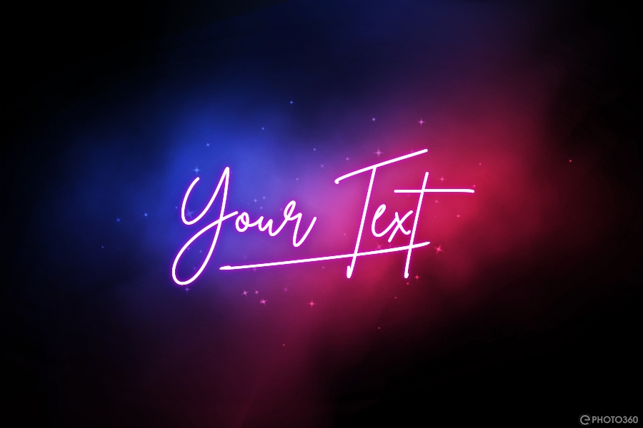
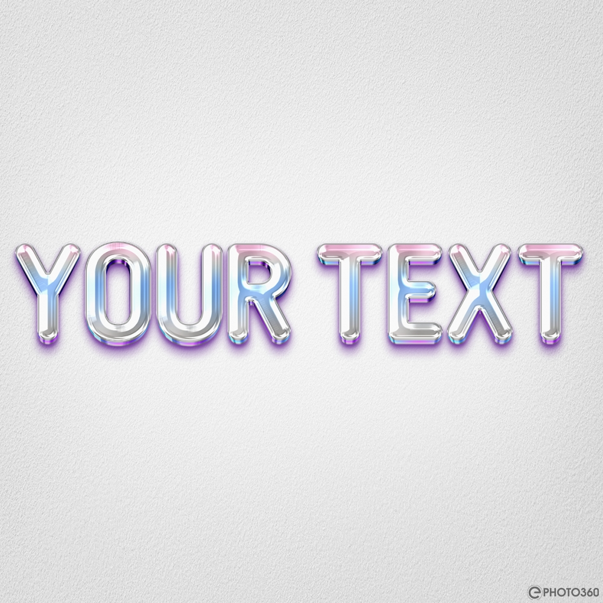
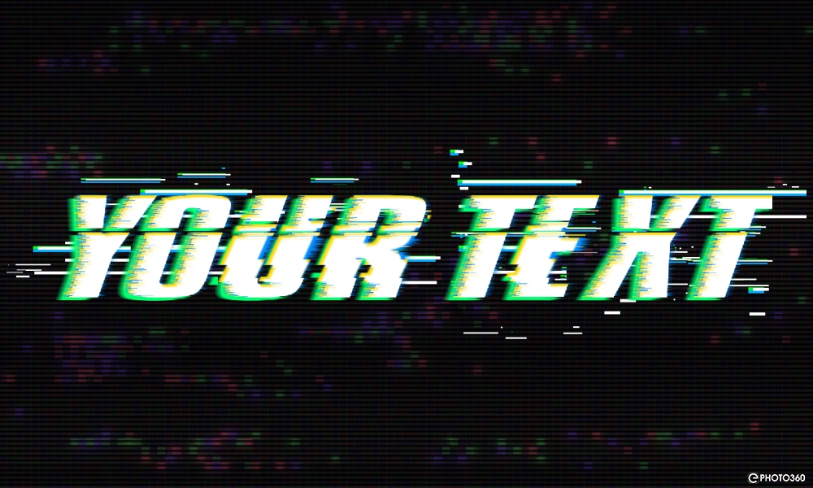

# Ephoto360

Python client for [Ephoto360.com](https://en.ephoto360.com) — scrapes and generates text/logo effect images. No API key needed.

---

###### I hope a STAR ⭐ from you 😊.

## Some Examples

Browse all at **[https://thehritu.github.io/Ephoto360/](https://thehritu.github.io/Ephoto360/)**.
Here are a few examples:

<div style="
  display: grid;
  grid-template-columns: repeat(2, minmax(220px, 1fr));
  gap: 16px;
  align-items: start;
">
  <figure style="
    margin: 0;
    border: 1px solid #e5e7eb;
    border-radius: 14px;
    overflow: hidden;
    background: #fff;
    box-shadow: 0 4px 14px rgba(0,0,0,0.06);
  ">
    
    <figcaption style="padding: 10px 12px; font: 14px/1.4 sans-serif; color: #374151;">
      <code>4618063429</code>
    </figcaption>
  </figure>

  <figure style="margin:0; border:1px solid #e5e7eb; border-radius:14px; overflow:hidden; background:#fff; box-shadow:0 4px 14px rgba(0,0,0,0.06);">
    
    <figcaption style="padding: 10px 12px; font: 14px/1.4 sans-serif; color: #374151;">
      <code>8</code>
    </figcaption>
  </figure>

  <figure style="margin:0; border:1px solid #e5e7eb; border-radius:14px; overflow:hidden; background:#fff; box-shadow:0 4px 14px rgba(0,0,0,0.06);">
    
    <figcaption style="padding: 10px 12px; font: 14px/1.4 sans-serif; color: #374151;">
      <code>2975689126</code>
    </figcaption>
  </figure>

  <figure style="margin:0; border:1px solid #e5e7eb; border-radius:14px; overflow:hidden; background:#fff; box-shadow:0 4px 14px rgba(0,0,0,0.06);">
    
    <figcaption style="padding: 10px 12px; font: 14px/1.4 sans-serif; color: #374151;">
      <code>829964308</code>
    </figcaption>
  </figure>

  <figure style="margin:0; border:1px solid #e5e7eb; border-radius:14px; overflow:hidden; background:#fff; box-shadow:0 4px 14px rgba(0,0,0,0.06);">
    
    <figcaption style="padding: 10px 12px; font: 14px/1.4 sans-serif; color: #374151;">
      <code>732453157</code>
    </figcaption>
  </figure>

  <figure style="margin:0; border:1px solid #e5e7eb; border-radius:14px; overflow:hidden; background:#fff; box-shadow:0 4px 14px rgba(0,0,0,0.06);">
    
    <figcaption style="padding: 10px 12px; font: 14px/1.4 sans-serif; color: #374151;">
      <code>1779834160</code>
    </figcaption>
  </figure>

  <figure style="margin:0; border:1px solid #e5e7eb; border-radius:14px; overflow:hidden; background:#fff; box-shadow:0 4px 14px rgba(0,0,0,0.06);">
    
    <figcaption style="padding: 10px 12px; font: 14px/1.4 sans-serif; color: #374151;">
      <code>732453157</code>
    </figcaption>
  </figure>

  <figure style="margin:0; border:1px solid #e5e7eb; border-radius:14px; overflow:hidden; background:#fff; box-shadow:0 4px 14px rgba(0,0,0,0.06);">
    
    <figcaption style="padding: 10px 12px; font: 14px/1.4 sans-serif; color: #374151;">
      <code>1779834160</code>
    </figcaption>
  </figure>
</div>

...and many more on the [List](https://thehritu.github.io/Ephoto360/).

## Installation

```bash
pip install Ephoto360 -U
```

---

## Setup

See [Finding Slug And Other Configs](https://github.com/TheHritu/Ephoto360#finding-slug-and-other-configs) before setup.

Simple setup:

```python
from Ephoto360 import Ephoto360

client = Ephoto360()
```

Use it as a context manager if you want the session cleaned up automatically:

```python
with Ephoto360() as client:
    ...
```

---

## Generating an image

```python
result = client.create(
    slug="/create-a-blackpink-style-logo-with-members-signatures-810.html",
    texts=["My Band"],
)

if result.ok:
    print(result.url)          # image URL
    result.save("output.jpg")  # download
else:
    print(result.error)
```

### Picking a style

Every effect has a `radio0[radio]` group (and sometimes `radio1[radio]` too and one has `radio2[radio]` too.). Pass a `styles` dict to pin specific ones:

```python
result = client.create(
    slug="/create-a-blackpink-style-logo-with-members-signatures-810.html",
    texts=["My Band"],
    styles={"radio0[radio]": "Jennie"},
)
```

For effects with two radio groups & When an effect requires 3 texts ( as ["a", "b", "c"] ) but only one is given, so two other "?" will be appended to the texts list:

```python
result = client.create(
    slug="/free-retro-neon-text-effect-online-538.html",
    texts=["RETRO"],
    styles={
        "radio0[radio]": "Bg 3",
        "radio1[radio]": "Style 2",
    },
)
```

Leave `styles` out and the first available option is used. Pass `random_style=True` if you want a random pick instead:

```python
result = client.create(slug, ["Hello"], random_style=True)
```

---

## Browsing the catalogue

```python
# all effects, alphabetically
for effect in client.list_effects():
    print(effect.slug)
    print(effect.name)
    print(effect.text_count, "text field(s)")
    print(effect.radio_keys)   # e.g. ['radio0[radio]', 'radio1[radio]']

# search by name or slug
results = client.search("neon")
results = client.search("blackpink")

# grab one directly — full slug or just the numeric tail works
info = client.get_effect("/create-a-blackpink-style-logo-with-members-signatures-810.html")
info = client.get_effect("810")   # same thing

# random effect
effect = client.random_effect(require_radio=True)
```

### Inspecting an effect

```python
info = client.get_effect("810")

print(info.name)           # "Create A Blackpink Style Logo With Members Signatures"
print(info.text_labels)    # ['Your text*']
print(info.style_labels)   # ['Jennie', 'Jisoo', 'Lisa', 'Rose']

# all options for a specific radio group
for style in info.options_for("radio0[radio]"):
    print(style.label, style.thumb)

# lookup by label (case-insensitive)
style = info.option_by_label("radio0[radio]", "lisa")

# lookup by position
style = info.option_by_index("radio0[radio]", 2)   # third option
```

---

## Generating all styles

Iterates every `radio0` option and returns one result per style. Good for previewing what an effect looks like across all variants.

```python
results = client.create_all_styles(
    slug="/create-a-blackpink-style-logo-with-members-signatures-810.html",
    texts=["My Band"],
)

for r in results:
    if r.ok:
        r.save(f"{r.style}.jpg")
```

Some effects have a lot of options (the LoL one has 322) LOL. Use `limit` to avoid firing hundreds of requests:

```python
results = client.create_all_styles(slug, ["My Band"], limit=10)
```

If the effect also has `radio1`, pin it while iterating `radio0`:

```python
results = client.create_all_styles(
    slug="/free-retro-neon-text-effect-online-538.html",
    texts=["RETRO"],
    radio1_label="Style 2",
    limit=6,
)
```

---

## Batch

```python
results = client.batch_create([
    {
        "slug": "/create-a-blackpink-style-logo-with-members-signatures-810.html",
        "texts": ["Alice"],
        "styles": {"radio0[radio]": "Jennie"},
    },
    {
        "slug": "/free-retro-neon-text-effect-online-538.html",
        "texts": ["RETRO"],
        "random_style": True,
    },
])
```

Runs sequentially. No concurrency — the site rate-limits aggressively enough that threading causes more problems than it solves.

---

## CreationResult fields

| Field    | Type            | Notes                                     |
| -------- | --------------- | ----------------------------------------- |
| `ok`     | `bool`          | `False` means something went wrong        |
| `url`    | `str`           | Remote image URL (only when `ok` is True) |
| `styles` | `dict[str,str]` | Maps radio key → label that was applied   |
| `style`  | `str`           | Shorthand for `styles["radio0[radio]"]`   |
| `slug`   | `str`           | Effect slug used                          |
| `error`  | `str`           | Populated only when `ok` is False         |

---

## Retry and timeout settings

```python
client = Ephoto360(
    retry_count=5,    # attempts before giving up (default 3)
    retry_delay=2.0,  # seconds between retries (default 1.5)
    timeout=60.0,     # per-request timeout in seconds (default 30)
)
```

---

# Finding Slug And Other Configs

Browse at **https://thehritu.github.io/Ephoto360**

## Coffee is love, coffee is life.

<a href="https://www.buymeacoffee.com/hritu" target="_blank"></a>

## Contributing

Contributions are welcome — open an issue or submit a pull request.

## License

MIT © TheHritu
